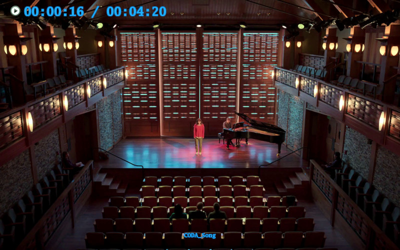
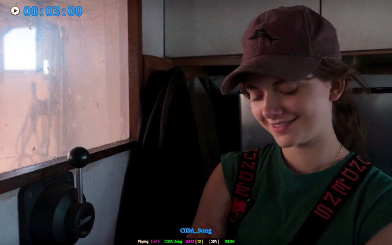
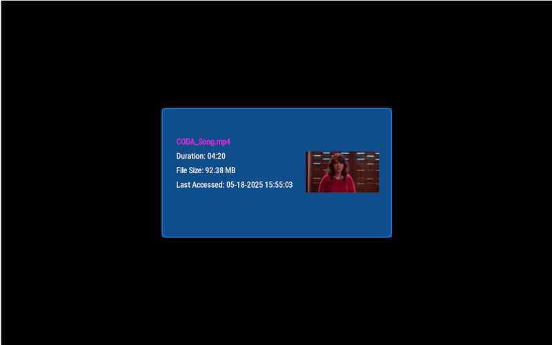
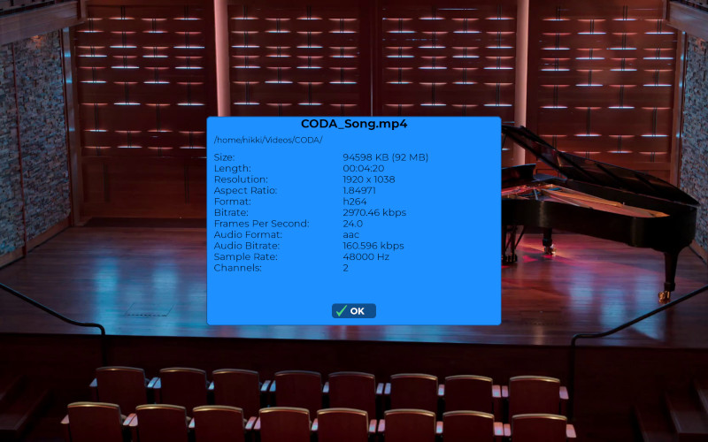
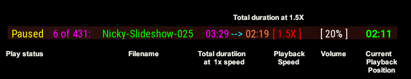

# 🎬 PyVid2 – A Video Playback Application

[](https://www.gnu.org/licenses/gpl-3.0)


## 💋 <span style="color:DodgerBlue">Overview</span>

pyVid2 is a **Python application** It is mainly designed as a presentation application which may continuously play media
in an automated manner. The latest version is  _vesion 0.50_

pyVid2 is unique in that it only supports playing videos that it finds in user supplied directories.  The scan in pyVid2 is capable of finding tens of thousands of playable media in just seconds. The resulting internal playlist is limited only by how much ram is available. The speed of course depends upon the hardware PyVid2 is running on.  For now, pyVid2 is only in the testing phase.  There are many features missing or not working correctly. In short, pyVid2 is not yet ready for prime time.

## 🧸 <span style="color:DodgerBlue">Features</span>

- Supports multiple video reader backends: **Auto, FFmpeg, OpenCV, ImageIO, Decord**
- Optimized for really fast directory scanning **speed and efficiency**.
- Handles **recursive directory scanning** for playable media.
- Can play .GIF files (feature in development)
- Lots of flexibility with a host of command line arguments.
- Easy to use.

## 🖥️ <span style="color:DodgerBlue">Screenshots</span>

Here are some examples of pyVid2 in action:


*Default playback.*


*Playback with OSD mode 1.*


*Playback with OSD mode 2 + video playback status bar (WIP).*


*Playback with video info splash. Definitely work in progress!*


*The very beginnings of a video metadata window*

<!--


**Default playback.**


**Playback with OSD mode 1.**


**Playback with OSD mode 2 plus status bar.**


**Playback showing video info splash screen.**
-->

## 🚀 <span style="color:DodgerBlue">Quick Start</span>

```sh
git clone https://github.com/NikkiCooper/pyVid2.git
cd pyVid2
# Install the required Python libraries
pip install -r requirements.txt
# Install required fonts to ~/.local/share/pyVid/fonts
./install.sh
# Sample invocation
python pyvid2.py --loop --shuffle --Paths ~/Videos
```

## 📜 <span style="color:DodgerBlue">Command-Line Arguments</span>

| **Option**                    | **Description**                                           |
|-------------------------------|-----------------------------------------------------------|
| `-h, --help`                  | Show help message and exit                                |
| `--Paths PATHS [PATHS ...]`   | Directories to scan for playable media                    |
| `--listActiveMonitors`        | Prints a list of detected active monitors to the console  |
| `--loadPlayList LOADPLAYLIST` | Load a playlist from a file (`/path/PlaylistName`)        |

### 📽️ **<span style="color:HotPink">Video Playback Options</span>**

| **Option**                   | **Description** |
|------------------------------|-----------------------------------------------------|
| `--loop`                     | Loop videos instead of exiting (**default: disabled**) |
| `--shuffle`                  | Play videos in random order (**default: disabled**) |
| `--disableGIF`               | Disable playing `.GIF` files (**default: enabled**) |
| `--enableFFprobe`            | Enable FFprobe when using OpenCV (**default: disabled**) |
| `--reader {auto, ffmpeg, opencv, imageio, dcord}` | Select video reading backend (**default: auto**) |
| `--interp {area, cubic, linear, nearest, lanczos4}` | Use interpolation for resizing frames (**default: cubic**) |
| `--loopDelay LOOPDELAY`      | Delay (in seconds) between videos (**default: 1 sec**) |
| `--playSpeed PLAYSPEED`      | Set playback speed (`0.5 - 5.0`, **default: 1.0**) |
| `--enableOSDcurpos`          | Enable on-screen display (OSD) position counter (**default: disabled**) |

### 🔊 **<span style="color:HotPink">Audio Settings</span>**

| **Option**                  | **Description**                                                                    |
|-----------------------------|------------------------------------------------------------------------------------|
| `--mute`                    | Mute all audio globally (**default: disabled**)                                    |
| `--noAudio`                 | Specify if videos have audio tracks (**default: assume videos might have audio**)  |
| `--audioTrack` AUDIOTRACK   | Selects which audio track to use. (**default: 0**)                                 |
| `--usePygameAudio`          | Use **Pygame** or **Pyaudio** (**default: Pyaudio**)                               |

### ⚙️ **<span style="color:HotPink">System Settings</span>**

| **Option**                   | **Description** |
|------------------------------|-----------------------------------------------------|
| `--verbose`                  | Show detailed errors and exceptions (**default: disabled**) |
| `--display DISPLAY`          | Output video on a specific display (**default: active display**) |
| `--consoleStatusBar`         | Enable debug status bar in the console (**default: disabled**) |

### 📁 **<span style="color:HotPink">File Handling</span>**

| **Option**                   | **Description** |
|------------------------------|-----------------------------------------------------|
| `--noIgnore`                 | Do not honor `.ignore` files (**default: honor .ignore files**) |
| `--noRecurse`                | Do not recurse into subdirectories (**default: recurse into all specified directories**) |
| `--printVideoList`           | Print a list of available videos |
| `--printIgnoreList`          | Search for `.ignore` files in specified directories |

### ✔️ <span style="color:DodgerBlue">Example Command-Line</span>

```sh
PyVid2 --loop --shuffle --enableFFprobe --Paths ~/SlideShows ~/MyVideos ~/mnt/MediaServer/Music \Videos
```

## 📚 <span style="color:DodgerBlue">Documentation</span>

### 🔖 <span style="color:DodgerBlue">Mutually exclusive arguments</span>
There are currently three command line arguments whose use are mutually exclusive of each other:
1. --Paths PATHS [PATHS ...]
2. --loadPlayList LOADPLAYLIST
3. --listActiveMonitors

Due to how _argparse_ handles mutually exclusive argument groups, **--listActiveMonitors** is shown as requiring a parameter.
when using **--help** or **-h**.  Passing a parameter to **--listActiveMonitors** is not necesesary.
The **--Paths** argument is _always_ required unless using **--loadPlayList**, or in more rare cases
**--listActiveMonitors**.  Supply **--Paths** with as many _directories_ you want scanned for media as necessary.
In order to use **--loadPlayList**, an active pyVid2 playlist must be saved to a file after pyVid2 is up and running by
pressing the 'w' key. This writes pyVid2s running playlist to ```~/VideoPlayList-SIZE.txt```, where **_SIZE_** is the
number of entries in the list.  Example: ```~/VideoPlayList-454.txt``` indicates there are 454 entries in the list. The
default path used for the saved playlist is **~**, however, this can be changed by setting an environment variable.
See **Environment variables** below. 

**NOTE:**
For the moment, pyVid2 lacks the ability to specify specific videos on the command-line to play!  This is not by 
accident but rather by design. pyVid2 was not designed for this purpose.  pyVid2 was designed as a presentation video player
supporting huge playlists consisting of thousands of entries. 

### 🔖 <span style="color:DodgerBlue">--noRecurse</span>
**--noRecurse** applies to _all_ paths supplied to the **--Paths** argument.  

### 🔖 <span style="color:DodgerBlue">--interp lanczos4</span>
When using **lanczos4** and **--playSpeed** with a playback speed > 1x, playback will experience some lost frames  unless
the hardware pyVid2 is running on is _very_ high end in performance.  This is due to the fact that **lanczos4**  by its
nature is very processor intensive.  PyVid2 defaults to ```interp=cubic```, which is suitable for most hardware.


### 🎬 <span style="color:DodgerBlue">Playback status bar</span>
The playback status bar is work in progress. It is automatically displayed when the mouse cursor is in the lower 15% of
the display. It accepts mouse button clicks too.  This includes the Playback speed and the Volume.  Left-clicking on the 
extreme left of the playback speed or the Volume decreases the values, Left-clicking on the extreme left of the playback
speed or the Volume decreases the values.  The Right-Mouse button also works, only in the opposite manner. 




As shown in the above illustration,  when the playback speed is anything other than [1X], the playback duration at that
speed is also displayed to the right of the -->.


### ⌨ <span style="color:DodgerBlue">Keyboard-commands</span>

There are a number of keyboard commands available while a video is playing:

- ░**d**░ = Debug: Print the value of all command line options to the console.
- ░**g**░ = Reshuffle video playlist in place.
- ░**i**░ = Show video metadata window. Click the **OK** button to clear. [work in progress] 
- ░**l**░ = Loop the currently playing video indefinately. This is a toggle.
- ░**m**░ = Toggle mute video.
- ░**n**░ = Advance to next video.
- ░**o**░ = Toggle OSD views.
- ░**p**░ or **Space Bar** = Pause video.
- ░**q**░ or **ESC** = Quit the program
- ░**r**░ = Restart the currently playing video back to the beginning.
- ░**s**░ = Save Screenshot to ~/pyVidScreenShots
- ░**w**░ = Save pyVid2s internal playlist to a file.
- ░ **+** ░ = (keypad) Increase playback speed by 0.50  (*max is 5.0*)
- ░ **-** ░ = (keypad) Decrease playback speed by 0.50  (*min is 0.50*)
- ░**→**░ Seek *forward* 20 seconds.
- ░**←**░ Seek *backward* 20 seconds.
- ░**↑**░ Increase the volume by 10%.
- ░**↓**░ Decrease the volume by 10%.
- **Backspace** = Play previous video.
<!--
- ➡️  = Seek 20 seconds.
- ⬅️  = seek -20 seconds.
- ⬆️  = Increase the volume by 10%
- ⬇️  = Decrease the volume by 10%
-->
<!-- ░a░ ░b░ ░c░ ░d░ ░e░ ░f░ ░g░ ░h░ ░i░ ░j░ ░k░ ░l░ ░m░ ░n░ ░o░ ░p░ ░q░ ░r░ ░s░ ░t░ ░u░ ░v░ ░w░ ░x░ ░y░ ░z░ ░+░ ░-░ ░ ░!░ ░@░ ░ ░#░ ░$░ ░%░ ░&░ ░ ░*░ ░(░ ░ ░)░   ░_░ ░+░ ░~░ ░1░ ░2░ ░3░ ░4░ ░5░ ░6░ ░7░ ░8░ ░9░ ░0░ ░|░ ░→░ ░←░ ░↑░ ░↓░
░A░ ░B░ ░C░ ░D░ ░E░ ░F░ ░G░ ░H░ ░I░ ░J░ ░K░ ░L░ ░M░ ░N░ ░O░ ░P░ ░Q░ ░R░ ░S░ ░T░ ░U░ ░V░ ░W░ ░X░ ░Y░ ░Z░ -->

### 🖱️ <span style="color:DodgerBlue">Mouse</mouse>

- **Left Mouse Long Press** = Advance to next video.  Long press = Left mouse button pressed >= 1 second.
- **Right Mouse Long Press** = Play previous video.  Long press = Right mouse button pressed >= 1 second.
- **Middle Mouse Long Press** = Pause Video toggle.  Long Press = Mouse Wheel button pressed >= 1 second.
- **Wheel UP** = Seek ahead 5 seconds.
- **Wheel Down** = Seek backwards 5 seconds.

### 💻 <span style="color:DodgerBlue">OSD</span>

There are three modes for the **On Screen Display**. Pressing the ░**o**░ key 3 times will toggle through the three modes:

1. **Off**
2. ▶️ **HH:MM:SS / HH:MM:SS**
3. ▶️ **HH:MM:SS**

In the *2nd* mode, the **HH:MM:SS** to the far left is the ***current play position***. The one to the far right is the ***total video duration*** time.
The *3rd* mode behaves in a special manner.  When the ***current play position*** is approx. ***20 seconds*** from the video end, its default color will slowly fade to a much brighter one giving a visual indication the video is 20 seconds from completion.  Currently, the OSD timings are displayed in the color of **DodgerBlue**. When the color fading begins in *mode 3*, The OSD text color slowly fades until it reaches **HotPink** which denotes the end of the video had been reached. By default, the OSD is ***OFF*** when **pyVid2** is run. The command line argument ***--enableOSDcurpos*** enables OSD mode 3 at runtime.

### 🔔 <span style="color:DodgerBlue">Ignore Files</span>

Ignore files take the form of **.ignore** The case does not matter.  Their purpose is to mark certain directories
in a directory tree structure as **ignored** whenever pyVid2 is scanning for media files. In linux, the typical way
to create an ignore file is: ```touch .ignore``` from the command-prompt. The following example illustrates the
concept:

```md
     +------------------+
     | Video_Repository |
     +------------------+
              |
              |
      +-------+--------+
      |                |
      |                |
 +----+-----+   +------+-------+
 |Music_Vids|   |SlideShow_Vids|
 +----------+   +--------------+
    .ignore      Slideshow1.mp4
    M1.mp4       Slideshow2.mp4
    M2.mp4       Slideshow3.mp4
    M3.mp3       Slideshow4.mp4
     ...              ...
```

In the above simplified example, if 'Video_Repository' is the directory pyVid2 is recursively scanning,
it will ignore all playable media in Music_Vids, while playing everything in SlideShow_Vids.  The usefulness of
*.ignore* files may not seem obvious with just 2 directories, but if Video_Repository had 100 subdirectories,
*.ignore* files can provide a quick and easy way to be able to view (and not to view) video content.  If pyVid2 is
given the **--printIgnoreList** command-line argument along with one or more directories to scan via **--Paths**, it will
produce a report in the console of all *.ignore* files found in the specified directory trees. For example: ```pyVid2 --printIgnoreList --Paths Video_Repository```.  By default, **pyVid2** honors all *.ignore* files it encounters. The command line argument **--noIgnore** will direct pyVid2 to ignore any *.ignore* files it encounters in any paths specified by the **--Paths** argument. **--noIgnore**  is global across all specified paths given to **--Paths**.  In other words,  to **pyVid2**,  it is an all or nothing proposition.

### ♻️ <span style="color:DodgerBlue">Environment Variables</span>

Command line arguments (if there are any) always take priority over any set environment variables.

- **PYGAME_DISPLAY=display** For multiple monitor setups. Sets the monitor to play media on.  Select 0|1|2 ...
- **SDL_VIDEO_MINIMIZE_ON_FOCUS_LOSS=0** For multi-monitor setups, this is necessary to avoid the video minimizing when it loses focus.
- **SAVE_PLAYLIST_PATH=path** Specifiy the path to save pyVids playlist to ('w' keyboard command)

Currently, there is only one command line argument that overrides any set environment variables:  **--display**.  For example: ```pyVid2 --display 2`` will start the video on monitor #2 on a three monitor setup.  Note that monitor numbers begin with 0.  By default, pyVid2 will render the video in the active monitor it is run in. Use **--listActiveMonitors** to retrieve a list of possible monitors to use with the **--display** argument.   

## 🛠️ <span style="color:DodgerBlue">Installation</span>

### ✅ <spam style="color:DodgerBlue">Requirements</spam>

- 🔗 [pygame>=2.6](https://www.pygame.org/download.shtml)
- 🔗 [cachetools>=75.8.0](https://pypi.org/project/cachetools/)
- 🔗 [setuptools>=5.5.2](https://pypi.org/project/setuptools/)
- 🔗 [pyvidplayer2>=0.9.26](https://pypi.org/project/pyvidplayer2/)

There are other requirements such as **_ffmpeg_** that will need to be installed via your Linux distributions 
package manager. Refer to your particular distributions documention for information how to accomplish that. 

```sh
git clone https://github.com/NikkiCooper/pyVid2.git
cd pyVid2
pip install -r requirements.txt
# Installs needed fonts to ~/.local/share/pyVid/fonts
./install.sh   
#run  ./pyvid2  from  this directory. 
./pyvid2 --help
```

## 💩 <span style="color:HotPink">Ubuntu Linux</span>

If pyVid2 doesn't run in your version of Ubuntu Linux, don't despair. Simply run pyVid2 in a
Python virtual environment using **venv**,  🔗  [Anaconda](https://www.anaconda.com/docs/getting-started/anaconda/install) or  🔗 [Miniconda](https://www.anaconda.com/docs/getting-started/miniconda/install)

### 😺 Using venv (easiest, is included with Python)

```sh
# Create the environment 
python -m venv pyvidenv
# Activate the new environment
source pyvidenv/bin/activate
# Install pyVid2 required libraries
cd "pyVid2_installation_dir"
pip install -r requirements.txt
```

###  🐍 Using Anaconda or Miniconda (requires that Anaconda or Miniconda be installed)

```sh
# Update to latest
conda update conda
# Create the environment
conda create -n pyvidenv python=3.12
# Activate the new environment
conda activate pyvidenv
# Install pyVid2 required libraries
cd "pyVid2_installation_dir"
pip install -r requirements.txt
```

## ☠️ <span style="color:DodgerBlue">Issues</span>

- PyVid2 is work in progress and does not pretend to be anything other than a learning tool.
- There are some usability bugs, but these are quickly being squashed.
- Note that only Linux is supported currently.
- For now only fullscreen mode is supported.
- ~~There are issues with using the OSD when playing videos less than the width of the screen being played on.~~
- Under Ubuntu Linux 24.04 LTS there may be audio issues.  Use --usePygameAudio as a workaround.
- If you have issues let me know, I will try to help.
