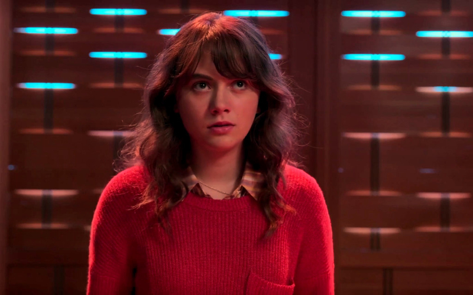
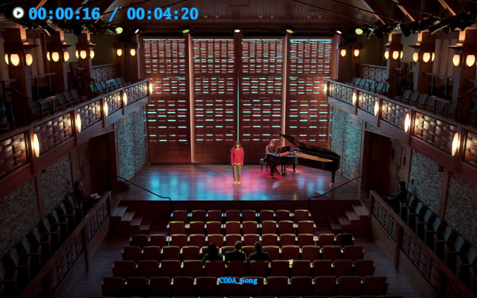
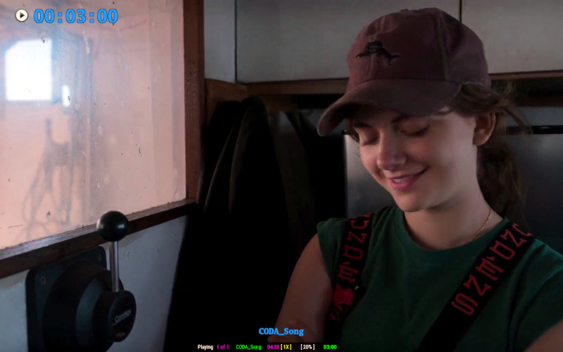
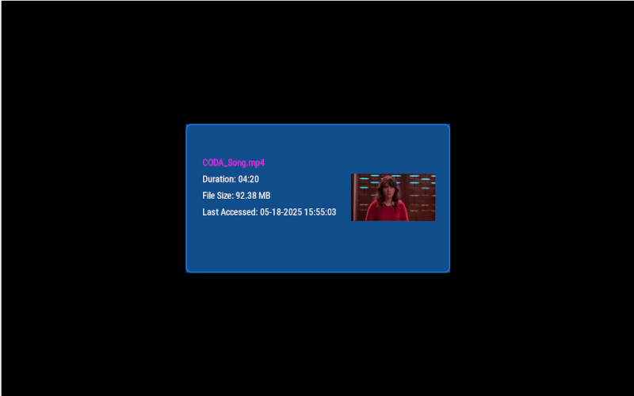
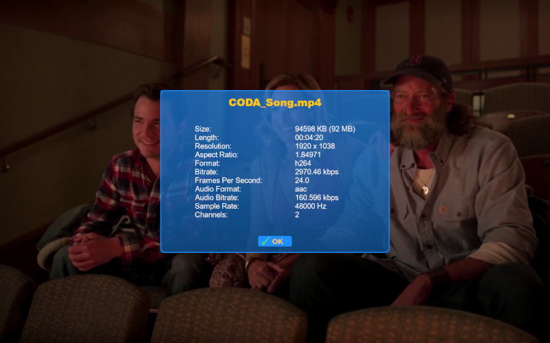
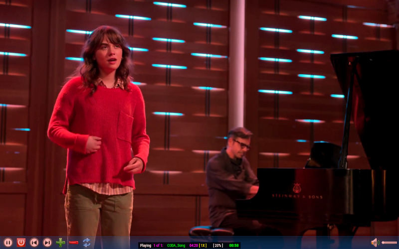
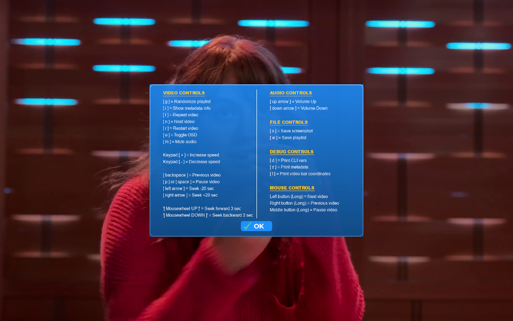
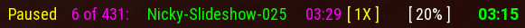
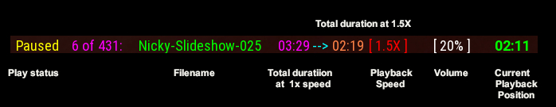

# 🎬 PyVid2 – A Video Playback Application

[](https://www.gnu.org/licenses/gpl-3.0)
[](https://www.python.org/downloads/release/python-3100/)


## 💋 <span style="color:DodgerBlue">Overview</span>

---
### **NOTE:**  This document is likely out of date relative to the Python code contained herein.

pyVid2 is a **Python application**. It is mainly designed as a presentation application which may continuously play media
in an automated manner. The latest version is  _version 0.60_

pyVid2 is unique in that it only supports playing videos that it finds in user supplied directories.  The scan in pyVid2 is capable of finding tens of thousands of playable media in just seconds. The resulting internal playlist is limited only by how much ram is available. The speed of course depends upon the hardware PyVid2 is running on.  For now, pyVid2 is only in the testing phase.  There are many features missing or not working correctly. In short, pyVid2 is not yet ready for prime time.

STARTING WITH VERSION >= 0.50, PLEASE NOTE THAT MONITOR SCALING IS OPTIMIZED TO 4K UHD MONITORS ONLY.
I HAVE NOT TRIED TO RUN pyVid2 ON LOWER RESOLUTION MONITORS, THUS IT IS NOT LIKELY TO RUN AS EXPECTED AS A RESULT.
 

## 🧸 <span style="color:DodgerBlue">Features</span>

- Supports multiple video reader backends: **Auto, FFmpeg, OpenCV, ImageIO, Decord**
- Optimized for really fast directory scanning **speed and efficiency**.
- Handles **recursive directory scanning** for playable media.
- Can play .GIF files (feature in development)
- Lots of flexibility with a host of command line arguments.
- Easy to use.

## 🖥️ <span style="color:DodgerBlue">Screenshots</span>

Here are some examples of pyVid2 in action:



*Default playback.*


*Playback with OSD mode 1.*


*Playback with OSD mode 2 + video playback status bar (WIP).*


*Playback with video info splash. Definitely work in progress!*


*Some small visual improvements made to the video metadata window*


*The very beginnings of a real video playback status bar.*


*New interactive help window*


<!--


**Default playback.**


**Playback with OSD mode 1.**


**Playback with OSD mode 2 plus status bar.**


**Playback showing video info splash screen.**
-->

## 🚀 <span style="color:DodgerBlue">Quick Start</span>

```sh
git clone https://github.com/NikkiCooper/pyVid2.git
cd pyVid2
# Install the required Python libraries
pip install -r requirements.txt
# Install required fonts to ~/.local/share/pyVid/fonts
./install.sh
# Sample invocation
python pyvid2.py --loop --shuffle --Paths ~/Videos
```
## 🎛️ <span style="color:DodgerBlue">Command-Line Argument Overview</span>


---

### 🎬 <span style="color:DodgerBlue">Required Input Options</span>

| Argument                | Description                                                                 |
|-------------------------|-----------------------------------------------------------------------------|
| `--Paths <Path>...`     | Directories to scan for playable media                                      |
| `--Files <File>...`     | Load and play supported media                                               |
| `--loadPlayList <File>...` | Load and play one or more playlist files (supports multiple playlists)   |
| `--listActiveMonitors`  | Lists detected monitors, then exits (helper for `--display`)                |

---

### 🎞️ <span style="color:DodgerBlue">Video Playback Options</span>

| Argument              | Description                                                                 |
|-----------------------|-----------------------------------------------------------------------------|
| `--loop`              | Loop videos instead of exiting                                               |
| `--shuffle`           | Play videos in random order                                                  |
| `--disableGIF`        | Disable `.gif` file playback                                                 |
| `--enableFFprobe`     | Enable FFprobe metadata analysis with OpenCV                                |
| `--reader`            | Choose video reader backend (`auto`, `ffmpeg`, `opencv`, `imageio`, `dcord`)|
| `--interp`            | Interpolation method (`area`, `cubic`, `linear`, `nearest`, `lanczos4`)     |
| `--loopDelay`         | Delay (in seconds) between videos. Default: `1`                             |
| `--playSpeed`         | Playback speed multiplier (`0.5`–`5.0`). Default: `1.0`                     |
| `--dispTitles`        | Show titles on: `all`, `portrait`, or `landscape` frames                    |
| `--showFilename`      | Display video filename on screen                                            |
| `--enableOSDcurpos`   | Enable current playback position on-screen overlay                          |

---

### 🎛️ <span style="color:DodgerBlue">Brightness & Contrast Options</span>

| Argument              | Description                                                                 |
|-----------------------|-----------------------------------------------------------------------------|
| `--adjust-video`      | Enables brightness/contrast controls (required for below)                  |
| `--brightness`        | Brightness level `-100` to `100`. Default: `0`                              |
| `--contrast`          | Contrast level `-127` to `127`. Default: `0`                                |

---

### 🔊 <span style="color:DodgerBlue">Audio Options</span>

| Argument              | Description                                                                 |
|-----------------------|-----------------------------------------------------------------------------|
| `--mute`              | Mute all audio globally                                                     |
| `--aTrack`            | Select audio track (integer index). Default: `0`                           |
| `--usePygameAudio`    | Use Pygame instead of PyAudio backend                                      |

---

### 🖥️ <span style="color:DodgerBlue">System Options</span>

| Argument              | Description                                                                 |
|-----------------------|-----------------------------------------------------------------------------|
| `--verbose`           | Enable verbose/debug output                                                 |
| `--display`           | Target specific display by index                                            |
| `--consoleStatusBar`  | Enables live status updates in terminal                                     |

---

### 🗂️ <span style="color:DodgerBlue">File Options</span>

| Argument               | Description                                                                 |
|------------------------|-----------------------------------------------------------------------------|
| `--noIgnore`           | Ignore `.ignore` files entirely                                             |
| `--noRecurse`          | Prevent recursive scanning in `--Paths` subfolders                          |
| `--separateDirs`       | Separate screen-shots into Landscape and Portrait sub-folders               |                              
| `--printVideoList`     | Output list of all playable videos from scan                                |
| `--printIgnoreList`    | Show `.ignore` file results from subfolders                                 |


---

### 🧪 <span style="color:DodgerBlue">Post-Processing Filter Options</span>

**CUDA-enabled filters:**
- `--contrast-enhance`
- `--cuda-bilateral`
- `--edge-detect`
- `--edges-sobel`
- `--emboss`
- `--gaussian-blur`
- `--greyscale`
- `--laplacian`
- `--median-blur`
- `--saturation`
- `--sepia`

**Filters with  support CUDA GPU acceleration when running in a Python virtual environment with OpenCV compiled with CUDA support.** If CUDA support is not detected at runtime, these filters will automatically fall back to CPU processing. Setting up a Python virtual environment and compiling OpenCV with CUDA support is beyond the scope of this document. For the most comprehensive CUDA support, including OpenCV Python CUDA bindings, consider using Arch Linux, which provides excellent CUDA integration and tooling support.

| Argument              | Description                                                                 |
|-----------------------|-----------------------------------------------------------------------------|
| `--cuda-bilateral`  | Enable CUDA-accelerated bilateral filter with default preset |
| `--laplacian`  | Apply sharpening to video |
| `--blur`              | Apply standard blur                                                         |
| `--median-blur`  | Enable median blur filtering |
| `--gaussian-blur`  | Enable Gaussian blur |
| `--contrast-enhance`  | Enable contrast enhancement filter |
| `--edges-sobel`  | Enable Sobel edge detection filter |
| `--noise`             | Add noise for stylistic grain                                               |
| `--cel-shading`       | Enable cel (toon-style) shading                                             |
| `--comic`             | Apply comic-book effect                                                     |
| `--thermal`           | Simulate thermal/heat vision palette                                        |
| `--emboss`  | Emboss the video |
| `--dream`             | Apply dreamy, soft focus effect                                             |
| `--pixelate`          | Pixelate the video (low-res aesthetic)                                      |
| `--neon`              | Apply neon outlining effect                                                 |
| `--fliplr`            | Flip horizontally (left ↔ right)                                            |
| `--flipup`            | Flip vertically (up ↕ down)                                                 |

---

### 🌊 <span style="color:DodgerBlue">Watercolor Effect Options</span>

| Argument                    | Description                                                                 |
|-----------------------------|-----------------------------------------------------------------------------|
| `--watercolor`              | Enable watercolor-style post-processing effect                              |
| `--watercolor-scale`        | Scale factor `0.25`–`1.0`. Lower = faster. Default: `0.5`                   |
| `--watercolor-quality`      | Quality/speed tradeoff: `fast`, `medium`, `high`. Default: `medium`         |

---

### 🖼️ <span style="color:DodgerBlue">Oil Painting Effect Options</span>

| Argument                    | Description                                                                 |
|-----------------------------|-----------------------------------------------------------------------------|
| `--oil-painting`            | Enable oil painting filter                                                  |
| `--oil-size`                | Neighborhood size `5`–`15`. Default: `7`                                    |
| `--oil-dynamics`            | Dynamic blending ratio `1`–`5`. Default: `1`                                |

---

### ✏️ <span style="color:DodgerBlue">Pencil Sketch Parameters</span>  
(from `scripts/pencil-sketch-1`)

| Parameter               | Description                                                                 | Default |
|-------------------------|-----------------------------------------------------------------------------|---------|
| `--sketch-detail`       | Detail level (odd number, higher = less detail)                             | `21`    |
| `--sketch-block-size`   | Block size for edge detection (`7–15`, odd only)                            | `9`     |
| `--sketch-c-value`      | Threshold sensitivity (`1–5`, higher = more edges)                          | `2`     |
| `--sketch-intensity`    | Intensity of the sketch effect (`0.0–1.0`)                                  | `0.7`   |
| `--edge-weight`         | Weight of edges in final image (`0.0–1.0`)                                  | `0.3`   |

> 🧠 For context, see [`scripts/pencil-sketch-1`](scripts/pencil-sketch-1) for full heredoc documentation and sample CLI usage.

---

### 🎭 <span style="color:DodgerBlue">Color Effect Options (Mutually Exclusive)</span>

| Argument             | Description                                                                 |
|----------------------|-----------------------------------------------------------------------------|
| `--greyscale`  | Convert video to greyscale |
| `--sepia`  | Apply sepia tone effect |
| `--vignette`         | Add vignette darkening around frame edges                                   |
| `--saturation`  | Adjust color saturation (`0.0`–`2.0`). Default: N/A |

---

### ⚡ <span style="color:DodgerBlue">Edge Detection Options</span>

| Argument               | Description                                                                |
|------------------------|----------------------------------------------------------------------------|
| `--edge-detect`  | Enable edge detection filter |
| `--edge-lower`         | Lower threshold (`0 <= value < upper`). Default: `100`                     |
| `--edge-upper`         | Upper threshold (`value <= 255`). Default: `200`                           |

---

### 🗯️ <span style="color:DodgerBlue">Comic Sharpening Filter Options</span>

| Argument                 | Description                                                              |
|--------------------------|--------------------------------------------------------------------------|
| `--comic-sharp`          | Enable comic-style sharpening pipeline                                  |
| `--comic-sharp-amount`   | Sharpening amount (`0.0–1.0`)                                            |
| `--bilateral-d`          | Bilateral filter diameter (`1–15`, odd only). Default: `5`              |
| `--bilateral-color`      | Bilateral color sigma (`10–200`). Default: `60`                         |
| `--bilateral-space`      | Bilateral space sigma (`10–200`). Default: `60`                         |
| `--edge-low`             | Lower threshold for comic edges. Default: `40`                          |
| `--edge-high`            | Upper threshold for comic edges. Default: `140`                         |
| `--color-quant`          | Color quantization factor (`1–64`). Default: `20`                       |

> 🎬 See example usage scripts in [`scripts/comic-sharp-1`](scripts/comic-sharp-1), [`-2`](scripts/comic-sharp-2), and [`-3`](scripts/comic-sharp-3)

---

### 🧪 <span style="color:DodgerBlue">Example Filter Demos</span>

| Script Name         | Description                                                                 |
|---------------------|-----------------------------------------------------------------------------|
| `comic-sharp-1`     | Basic usage of `--comic-sharp` with default params                          |
| `comic-sharp-2`     | Intermediate setup with custom bilateral/edge tweaks                       |
| `comic-sharp-3`     | Advanced comic effect with color quant + sharpening                        |
| `pencil-sketch-1`   | Heredoc example + full CLI usage for pencil sketch                         |

---

### 📖 <span style="color:DodgerBlue">Post-Processing Filters Documentation</span>

This section provides comprehensive documentation for all post-processing filters available in pyVid2.

---

#### 🔍 <span style="color:DodgerBlue">Blur Filters</span>

| Filter | Parameters | Description | CPU | CUDA |
|--------|-----------|-------------|-----|------|
| `--blur` | None | Applies standard blur effect to soften the video image | ✅ | ❌ |
| `--gaussian-blur` | None | Applies Gaussian blur for smooth, natural-looking blur effect | ✅ |  |
| `--median-blur` | None | Reduces noise while preserving edges using median filtering | ✅ |  |

---

#### ✨ <span style="color:DodgerBlue">Enhancement Filters</span>

| Filter | Parameters | Description | CPU | CUDA |
|--------|-----------|-------------|-----|------|
| `--laplacian` | None | Sharpens video by enhancing edges using Laplacian kernel | ✅ |  |
| `--contrast-enhance` | None | Automatically enhances contrast for improved visual clarity | ✅ |  |
| `--neon` | None | Creates neon-style glowing edge outlines | ✅ | ❌ |
| `--dream` | None | Applies soft-focus dreamy effect with ethereal quality | ✅ | ❌ |

---

#### 🎨 <span style="color:DodgerBlue">Artistic & Stylistic Filters</span>

| Filter | Parameters | Description | CPU | CUDA |
|--------|-----------|-------------|-----|------|
| `--cel-shading` | None | Creates cartoon/anime-style cel-shaded appearance | ✅ | ❌ |
| `--comic` | None | Applies comic book-style visual effect | ✅ | ❌ |
| `--emboss` | None | Creates 3D embossed relief effect | ✅ |  |
| `--pixelate` | None | Pixelates video for retro 8-bit aesthetic | ✅ | ❌ |
| `--thermal` | None | Simulates thermal/infrared heat vision palette | ✅ | ❌ |
| `--noise` | None | Adds film grain noise for vintage or stylistic effect | ✅ | ❌ |

---

#### 🌈 <span style="color:DodgerBlue">Color Manipulation Filters</span>

**Note:** `--greyscale` and `--sepia` are mutually exclusive with `--vignette` and `--saturation`.

| Filter | Parameters | Description | CPU | CUDA |
|--------|-----------|-------------|-----|------|
| `--greyscale` | None | Converts video to greyscale (black and white) | ✅ |  |
| `--sepia` | None | Applies warm sepia tone for vintage photograph effect | ✅ |  |
| `--saturation` | `0.0`-`2.0` | Adjusts color saturation intensity (values > 1.0 increase vibrancy) | ✅ |  |
| `--vignette` | None | Darkens frame edges for cinematic focus effect | ✅ | ❌ |

---

#### 🔲 <span style="color:DodgerBlue">Edge Detection Filters</span>

| Filter | Parameters | Description | CPU | CUDA |
|--------|-----------|-------------|-----|------|
| `--edge-detect` | `--edge-lower` (default: 100)<br>`--edge-upper` (default: 200) | Canny edge detection with adjustable thresholds (0-255) | ✅ |  |
| `--edges-sobel` | None | Sobel operator edge detection for gradient-based edges | ✅ |  |

**Edge Detection Parameters:**
- `--edge-lower`: Lower threshold for Canny edge detection (must be < upper threshold)
- `--edge-upper`: Upper threshold for Canny edge detection (0-255)

---

#### 🎭 <span style="color:DodgerBlue">Transformation Filters</span>

| Filter | Parameters | Description | CPU | CUDA |
|--------|-----------|-------------|-----|------|
| `--fliplr` | None | Flips video horizontally (mirror left-right) | ✅ | ❌ |
| `--flipup` | None | Flips video vertically (upside down) | ✅ | ❌ |

---

#### 🖼️ <span style="color:DodgerBlue">Complex Effect Filters</span>

| Filter | Parameters | Description | CPU | CUDA |
|--------|-----------|-------------|-----|------|
| `--cuda-bilateral` | None | Edge-preserving smoothing filter with 'default' preset | ✅ |  |
| `--watercolor` | `--watercolor-scale` (default: 0.5)<br>`--watercolor-quality` (default: medium) | Watercolor painting effect (computationally intensive) | ✅ | ❌ |
| `--oil-painting` | `--oil-size` (default: 7)<br>`--oil-dynamics` (default: 1) | Oil painting artistic effect | ✅ | ❌ |
| `--pencil-sketch` | `--sketch-detail` (default: 21)<br>`--sketch-block-size` (default: 9)<br>`--sketch-c-value` (default: 2)<br>`--sketch-intensity` (default: 0.7)<br>`--edge-weight` (default: 0.3) | Pencil sketch drawing effect | ✅ | ❌ |
| `--comic-sharp` | `--comic-sharp-amount` (default: 0.5)<br>`--bilateral-d` (default: 5)<br>`--bilateral-color` (default: 60)<br>`--bilateral-space` (default: 60)<br>`--edge-low` (default: 40)<br>`--edge-high` (default: 140)<br>`--color-quant` (default: 20) | Comic-style sharpening pipeline | ✅ | ❌ |

**Note:** Despite the name `--cuda-bilateral`, this filter supports both CPU and CUDA execution with automatic fallback. Interactive panel accessible via keyboard `[f]` during playback for preset selection.

**Bilateral Filter Parameters:**
- No additional parameters (uses preset system)

**Watercolor Effect Parameters:**
- `--watercolor-scale`: Scale factor `0.25`-`1.0` (lower = faster, less detail)
- `--watercolor-quality`: Quality vs. speed trade-off (`fast`, `medium`, `high`)

**Oil Painting Effect Parameters:**
- `--oil-size`: Neighborhood size `5`-`15` for oil painting brush strokes
- `--oil-dynamics`: Dynamic blending ratio `1`-`5` for color mixing

**Pencil Sketch Effect Parameters:**
- `--sketch-detail`: Detail level (odd numbers, higher = less detail)
- `--sketch-block-size`: Block size for edge detection (`7`-`15`, odd only)
- `--sketch-c-value`: Threshold sensitivity (`1`-`5`, higher = more edges)
- `--sketch-intensity`: Intensity of sketch effect (`0.0`-`1.0`)
- `--edge-weight`: Weight of edges in final composition (`0.0`-`1.0`)

**Comic Sharp Effect Parameters:**
- `--comic-sharp-amount`: Sharpening intensity (`0.0`-`1.0`)
- `--bilateral-d`: Bilateral filter diameter (`1`,`3`,`5`,`7`,`9`,`11`,`13`,`15`, odd numbers only)
- `--bilateral-color`: Bilateral filter color sigma (`10`-`200`)
- `--bilateral-space`: Bilateral filter space sigma (`10`-`200`)
- `--edge-low`: Lower threshold for comic edge detection (`0`-`255`)
- `--edge-high`: Upper threshold for comic edge detection (`0`-`255`)
- `--color-quant`: Color quantization factor (`1`-`64`, lower = more posterization)

---

#### 💡 <span style="color:DodgerBlue">Filter Usage Tips</span>

- **CUDA Filters**: Filters marked with  support GPU acceleration when cv2 is compiled with CUDA support
- **Performance**: Complex filters like `--watercolor` are computationally expensive; reduce `--watercolor-scale` for better performance
- **Combining Filters**: Multiple filters can be combined, but some are mutually exclusive (see individual filter notes)
- **Interactive Controls**: Many filters have keyboard shortcuts for runtime toggling (press `[h]` during playback for help)
- **Presets**: Complex filters like bilateral and oil painting support interactive panels during playback

---


### ✔️ <span style="color:DodgerBlue">Example Command-Line</span>

```sh
PyVid2 --loop --shuffle --enableFFprobe --Paths ~/SlideShows ~/MyVideos ~/mnt/MediaServer/Music\ Videos
```

## 📚 <span style="color:DodgerBlue">Documentation</span>

### 🔖 <span style="color:DodgerBlue">Mutually exclusive arguments</span>
There are currently four command line arguments whose use are mutually exclusive of each other:
1. --Paths PATHS [PATHS ...]
2. --Files FILES [FILES ...] 
3. --loadPlayList LOADPLAYLIST
4. --listActiveMonitors

Due to how _argparse_ handles mutually exclusive argument groups, **--listActiveMonitors** is shown as requiring a parameter
when using **--help** or **-h**.  Passing a parameter to **--listActiveMonitors** is not necessary.
The **--Paths** argument is _always_ required unless using **--Files**, **--loadPlayList**, or in more rare cases
**--listActiveMonitors**.  Supply **--Paths** with as many _directories_ you want scanned for media as necessary.
Supply **--Files** with as many path/filespec pairs as necessary.
In order to use **--loadPlayList**, an active pyVid2 playlist must be saved to a file after pyVid2 is up and running by
pressing the 'w' key. This writes pyVid2s running playlist to ```~/VideoPlayList-SIZE.txt```, where **_SIZE_** is the
number of entries in the list.  Example: ```~/VideoPlayList-454.txt``` indicates there are 454 entries in the list. The
default path used for the saved playlist is **~**, however, this can be changed by setting an environment variable.
See **Environment variables** below. 

**NOTE:**
~~For the moment, pyVid2 lacks the ability to specify specific videos on the command-line to play!  This is not by 
accident but rather by design. pyVid2 was not designed for this purpose.  pyVid2 was designed as a presentation video player
supporting huge playlists consisting of thousands of entries.~~ 

### 🔖 <span style="color:DodgerBlue">--noRecurse</span>
**--noRecurse** applies to _all_ paths supplied to the **--Paths** argument.  

### 🔖 <span style="color:DodgerBlue">--interp lanczos4</span>
When using **lanczos4** and **--playSpeed** with a playback speed > 1x, playback will experience some lost frames unless
the hardware pyVid2 is running on is _very_ high end in performance.  This is due to the fact that **lanczos4** by its
nature is very processor intensive.  PyVid2 defaults to ```interp=cubic```, which is suitable for most hardware.


### 🎬 <span style="color:DodgerBlue">Playback status bar</span>
The playback status bar is work in progress. It is automatically displayed when the mouse cursor is in the lower 15% of
the display. It accepts mouse button clicks too.  This includes the Playback speed and the Volume.  Left-clicking on the
extreme left of the playback speed or the Volume decreases the values.  The Right-Mouse button also works, only in the opposite manner. 





As shown in the above illustration,  when the playback speed is anything other than [1X], the playback duration at that
speed is also displayed to the right of the -->.


### ⌨ <span style="color:DodgerBlue">Keyboard Commands</span>

#### **Playback Control**
- `p` or `Space` — Pause/unpause video
- `n` — Advance to next video
- `Backspace` — Play previous video
- `r` or `Home` — Restart current video from the beginning
- `q` or `Esc` — Quit the program
- `End` — Seek to last 10 seconds of video
- `→` — Seek forward 20 seconds
- `←` — Seek backward 20 seconds
- `l` — Toggle loop current video indefinitely
- `+` (keypad) — Increase playback speed by 0.50 (*max 5.0*)
- `-` (keypad) — Decrease playback speed by 0.50 (*min 0.50*)

#### **Audio Control**
- `m` — Toggle mute
- `↑` — Increase volume by 10%
- `↓` — Decrease volume by 10%

#### **Display & Information**
- `o` — Toggle OSD views (3 states: off / position+duration / position only)
- `t` — Toggle video title display (4 states: None → all → portrait → landscape)
- `h` — Show keyboard help panel
- `Shift+H` — Show filter help panel
- `i` — Show video metadata window
- `Shift+I` — Cycle interpolation method (linear → cubic → lanczos4)

#### **Playlist Management**
- `j` — Reshuffle video playlist in place
- `w` — Save current playlist to file (~/VideoPlayList-SIZE.txt)

#### **Screenshot & Save Mode**
- `s` — Save screenshot to ~/pyVidScreenShots
- `Alt+S` — Toggle save mode (remaps Space Bar to screenshot function)

#### **Filter Panels**
- `c` — Toggle brightness/contrast panel
- `Shift+C` — Toggle brightness/contrast filter on/off
- `e` — Toggle edge detection panel
- `Shift+E` — Toggle edge detection filter on/off
- `f` — Toggle CUDA bilateral filter panel
- `x` — Cycle through bilateral filter presets
- `z` — Toggle oil painting panel
- `Shift+Z` — Toggle oil painting filter on/off
- `!` (Shift+1) — Toggle Laplacian Boost panel
- `Shift+!` — Toggle Laplacian Boost filter on/off
- `*` (Shift+8) — Toggle sepia panel
- `Shift+*` — Toggle "Super-Sepia" effect on/off
- `Insert` — Toggle filter checkbox panel
- `Delete` — Show filter info list

#### **Simple Filters (Toggle On/Off)**
- `u` — Sharpening filter #1
- `@` (Shift+2) — Blur filter
- `(` (Shift+9) — Gaussian blur filter (CUDA)
- `)` (Shift+0) — Median blur filter (CUDA)
- `g` — Greyscale filter (CUDA)
- `k` — Edge Sobel filter (CUDA)
- `v` — Noise filter
- `/` — Denoise filter
- `$` (Shift+4) — Emboss filter (CUDA)
- `%` (Shift+5) — Thermal filter
- `#` (Shift+3) — Edge detect toggle

#### **Enhancement Filters (Toggle On/Off)**
- `;` — Contrast enhancement (CUDA)
- `:` (Shift+;) — Neon enhancement
- `'` — Vignette enhancement
- `"` (Shift+') — Pixelate enhancement
- `<` (Shift+,) — Cel-shading enhancement
- `^` (Shift+6) — Dream enhancement
- `&` (Shift+7) — Comic enhancement
- `` ` `` — Artistic filter toggle

#### **Transformation**
- `,` — Flip video horizontally (left-right)
- `.` — Flip video vertically (up-down)

#### **Disable All Filters**
- `[` — Disable all active filters

#### **Debug & Development**
- `d` — Print all command-line options to console
- `b` — Print VideoPlayBar icon rectangles (debug)

### 🖱️ <span style="color:DodgerBlue">Mouse</mouse>

- **Left Mouse Long Press** — Advance to next video (press ≥ 1 second)
- **Right Mouse Long Press** — Play previous video (press ≥ 1 second)
- **Middle Mouse Long Press** — Pause/unpause video (press ≥ 1 second)
- **Wheel Up** — Seek ahead 5 seconds
- **Wheel Down** — Seek backwards 5 seconds

### 💻 <span style="color:DodgerBlue">OSD</span>

There are three modes for the **On Screen Display**. Pressing the `o` key 3 times will toggle through the three modes:

1. **Off**
2. ▶️ **HH:MM:SS / HH:MM:SS**
3. ▶️ **HH:MM:SS**

In the *2nd* mode, the **HH:MM:SS** to the far left is the ***current play position***. The one to the far right is the ***total video duration*** time.
The *3rd* mode behaves in a special manner.  When the ***current play position*** is approx. ***20 seconds*** from the video end, its default color will slowly fade to a much brighter one giving a visual indication the video is 20 seconds from completion.  Currently, the OSD timings are displayed in the color of **DodgerBlue**. When the color fading begins in *mode 3*, the OSD text color slowly fades until it reaches **HotPink** which denotes the end of the video has been reached. By default, the OSD is ***OFF*** when **pyVid2** is run. The command line argument ***--enableOSDcurpos*** enables OSD mode 3 at runtime.


### 💻 <span style="color:DodgerBlue">Portrait frame Detection</span>

Portrait frame detection determines whether a given image surface represents a "portrait" orientation by analyzing its pixel data. The method inspects specific regions on the left and right edges of the
image to verify if they contain predominantly black pixels (with a threshold applied for RGB channel values). The function relies on efficient pixel access and locks the input surface during processing. The portrait detection is based on specified areas and is useful for identifying images surrounded by black padding.  Note that this is highly experimental and is likely to not be useful to the vast majority of users.  In fact, it is likely to not even work at all!  Currently, **Display Video Title**,  **--dispTitle** and friends (see below), as well as screenshot saving when using the command line argument **--separateDirs** make use of this. When specifying **--separateDirs** on the command line and upon saving a screenshot, Portrait frame detection is enabled and saved screenshots will be placed in Landscape and Portrait subfolders.  This functionality has very limited usefulness and will likely **NOT** work for most people.   


### 💻 <span style="color:DodgerBlue">Display Video Title</span>

This command key (t) along with its command line interface counterpart **--dispTitle** deserves some explanation.
pyVid2 has some very specific use cases that probably will not be of much use to most users.  In the world of video, there is no such thing as 'portrait' (where the image height > image width) or 'landscape' (where the image width > image height). In video, each displayed frame is *always* the same size. That having been said, pyVid2 is a *presentation* video player.  Consider the usage case
of a photographer. He or she may wish to showcase their work by rendering their photos into slideshow videos.  These videos will likely have different transition effects for each slide or photo.  In the world of photography, depending upon the subject, many photos will likely be taken in both portrait and landscape.  Thus, when these photos are rendered into a video slideshow, the resulting video will consist of photos representing both.  Other subjects might consist only of landscape photos or just portrait photos. **--dispTitle** can take one of three possible parameters.  These are:
- **all**       =  Display metadata title tag text on all frames
- **portrait**  =  Display metadata title tag text on detected portrait frames
- **landscape** =  Display metadata title tag text on landscape frames (likely all frames)

The portrait detection algorithm is rather crude. There are so many cases where this will fail.  It is suggested to just use **all** and not worry about it. The command key (t) will toggle between the various possible states: **None**->**all**->**portrait**->**landscape**->**None**

Note that the selection of any parameter other than **all** is likely not going to work as intended.  Customized metadata tags can be added to a mp4 video (and likely others) by using ffmpeg:
```sh
# The -c copy is very important as it will prevent having to transcode the entire video over again. 
ffmpeg -loglevel quiet -i video.mp4 -c copy -movflags use_metadata_tags -metadata title="Nikki and the girls on vacation in the Outback!" output.mp4
```
The new tag called **title** can be verified by using ffprobe:
```sh
ffprobe -loglevel quiet -show_format output.mp4  | grep TAG:title | cut --delimiter='=' -f2
Nikki and the girls on vacation in the Outback!
$
```


### 🔔 <span style="color:DodgerBlue">Ignore Files</span>

Ignore files take the form of **.ignore** The case does not matter.  Their purpose is to mark certain directories
in a directory tree structure as **ignored** whenever pyVid2 is scanning for media files. In linux, the typical way
to create an ignore file is: ```touch .ignore``` from the command-prompt. The following example illustrates the
concept:

```md
     +------------------+
     | Video_Repository |
     +------------------+
              |
              |
      +-------+--------+
      |                |
      |                |
 +----+-----+   +------+-------+
 |Music_Vids|   |SlideShow_Vids|
 +----------+   +--------------+
    .ignore      Slideshow1.mp4
    M1.mp4       Slideshow2.mp4
    M2.mp4       Slideshow3.mp4
    M3.mp3       Slideshow4.mp4
     ...              ...
```

In the above simplified example, if 'Video_Repository' is the directory pyVid2 is recursively scanning,
it will ignore all playable media in Music_Vids, while playing everything in SlideShow_Vids.  The usefulness of
*.ignore* files may not seem obvious with just 2 directories, but if Video_Repository had 100 subdirectories,
*.ignore* files can provide a quick and easy way to be able to view (and not to view) video content.  If pyVid2 is
given the **--printIgnoreList** command-line argument along with one or more directories to scan via **--Paths**, it will
produce a report in the console of all *.ignore* files found in the specified directory trees. For example: ```pyVid2 --printIgnoreList --Paths Video_Repository```.  By default, **pyVid2** honors all *.ignore* files it encounters. The command line argument **--noIgnore** will direct pyVid2 to ignore any *.ignore* files it encounters in any paths specified by the **--Paths** argument. **--noIgnore**  is global across all specified paths given to **--Paths**.  In other words,  to **pyVid2**,  it is an all or nothing proposition.

### ♻️ <span style="color:DodgerBlue">Environment Variables</span>

Command line arguments (if there are any) always take priority over any set environment variables.

- **PYGAME_DISPLAY=display** For multiple monitor setups. Sets the monitor to play media on.  Select 0|1|2 ...
- **SDL_VIDEO_MINIMIZE_ON_FOCUS_LOSS=0** For multi-monitor setups, this is necessary to avoid the video minimizing when it loses focus.
- **SAVE_PLAYLIST_PATH=path** Specify the path to save pyVids playlist to ('w' keyboard command)

Currently, there is only one command line argument that overrides any set environment variables:  **--display**.  For example: ```pyVid2 --display 2``` will start the video on monitor #2 on a three monitor setup.  Note that monitor numbers begin with 0.  By default, pyVid2 will render the video in the active monitor it is run in. Use **--listActiveMonitors** to retrieve a list of possible monitors to use with the **--display** argument.   

## 🛠️ <span style="color:DodgerBlue">Installation</span>

### ✅ <span style="color:DodgerBlue">Requirements</span>

- 🔗 [pygame>=2.6](https://www.pygame.org/download.shtml)
- 🔗 [cachetools>=75.8.0](https://pypi.org/project/cachetools/)
- 🔗 [setuptools>=5.5.2](https://pypi.org/project/setuptools/)
- 🔗 [pyvidplayer2>=0.9.26](https://pypi.org/project/pyvidplayer2/)

There are other requirements such as **_ffmpeg_** that will need to be installed via your Linux distribution's
package manager. Refer to your particular distribution's documentation for information how to accomplish that. 

```sh
git clone https://github.com/NikkiCooper/pyVid2.git
cd pyVid2
pip install -r requirements.txt
# Installs needed fonts to ~/.local/share/pyVid/fonts
./install.sh   
#run  ./pyvid2  from  this directory. 
./pyvid2 --help
```

## 💩 <span style="color:HotPink">Ubuntu Linux</span>

If pyVid2 doesn't run in your version of Ubuntu Linux, don't despair. Simply run pyVid2 in a
Python virtual environment using **venv**,  🔗  [Anaconda](https://www.anaconda.com/docs/getting-started/anaconda/install) or  🔗 [Miniconda](https://www.anaconda.com/docs/getting-started/miniconda/install)

### 😺 Using venv (easiest, is included with Python)

```sh
# Create the environment 
python -m venv pyvidenv
# Activate the new environment
source pyvidenv/bin/activate
# Install pyVid2 required libraries
cd "pyVid2_installation_dir"
pip install -r requirements.txt
```

###  🐍 Using Anaconda or Miniconda (requires that Anaconda or Miniconda be installed)

```sh
# Update to latest
conda update conda
# Create the environment
conda create -n pyvidenv python=3.12
# Activate the new environment
conda activate pyvidenv
# Install pyVid2 required libraries
cd "pyVid2_installation_dir"
pip install -r requirements.txt
```

## ☠️ <span style="color:DodgerBlue">Issues</span>

- PyVid2 is work in progress and does not pretend to be anything other than a learning tool.
- There are some usability bugs, but these are quickly being squashed.
- Note that only Linux is supported currently.
- For now only fullscreen mode is supported.
- ~~There are issues with using the OSD when playing videos less than the width of the screen being played on.~~
- Under Ubuntu Linux 24.04 LTS there may be audio issues.  Use --usePygameAudio as a workaround.
- If you have issues let me know, I will try to help.
